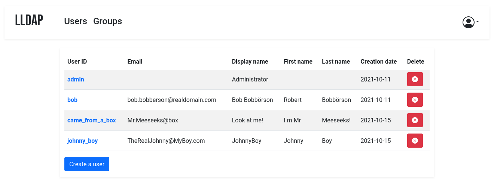

# lldap - Light LDAP implementation for authentication


WARNING: This project is still in alpha, with the basic core functionality
implemented but still very rough. For updates, follow
[@nitnelave1](https://twitter.com/nitnelave1) or join our [Discord
server](https://discord.gg/h5PEdRMNyP)!


This project is an lightweight authentication server that provides an
opinionated, simplified LDAP interface for authentication: clients that can
only speak LDAP protocol can talk to it and use it as an authentication server.



The goal is _not_ to provide a full LDAP server; if you're interested in that,
check out OpenLDAP. This server is a user management system that is:
* simple to setup (no messing around with `slapd`)
* simple to manage (friendly web UI)
* opinionated with basic defaults so you don't have to understand the
  subtleties of LDAP.

It mostly targets self-hosting servers, with open-source components like
Nextcloud, Airsonic and so on that only support LDAP as a source of external
authentication.

For more features (OAuth/OpenID support, reverse proxy, ...) you can install
other components (KeyCloak, Authelia, ...) using this server as the source of
truth for users, via LDAP.

## Setup

### With Docker

The image is available at `nitnelave/lldap`. You should persist the `/data`
folder, which contains your configuration, the database and the private key
file (unless you move them in the config).

Configure the server by copying the `lldap_config.docker_template.toml` to
`/data/lldap_config.toml` and updating the configuration values (especially the
`jwt_secret` and `ldap_user_pass`, unless you override them with env variables).
Environment variables should be prefixed with `LLDAP_` to override the
configuration.

Example for docker compose:

```yaml
volumes:
  lldap_data:
    driver: local

services:
  lldap:
    image: nitnelave/lldap
    ports:
      # For LDAP
      - "3890:3890"
      # For the web front-end
      - "17170:17170"
    volumes:
      - "lldap_data:/data"
    environment:
      - LLDAP_JWT_SECRET=REPLACE_WITH_RANDOM
      - LLDAP_LDAP_USER_PASS=REPLACE_WITH_PASSWORD
      - LLDAP_LDAP_BASE_DN=dc=example,dc=com
```

Then the service will listen on two ports, one for LDAP and one for the web
front-end.

### From source

To bring up the server, you'll need to compile the frontend. In addition to
cargo, you'll need:

* WASM-pack: `cargo install wasm-pack`
* rollup.js: `npm install rollup`

Then you can build the frontend files with `./app/build.sh` (you'll need to run
this after every front-end change to update the WASM package served).

To bring up the server, just run `cargo run`. The default config is in
`src/infra/configuration.rs`, but you can override it by creating an
`lldap_config.toml`, setting environment variables or passing arguments to
`cargo run`.

## Client configuration

To configure the services that will talk to LLDAP, here are the values:
  - The LDAP user DN is from the configuration. By default,
    `cn=admin,dc=example,dc=com`.
  - The LDAP password is from the configuration (same as to log in to the web
    UI).
  - The users are all located in `ou=people,` + the base DN, so by default user
    `bob` is at `cn=bob,ou=people,dc=example,dc=com`.
  - Similarly, the groups are located in `ou=groups`, so the group `family`
    will be at `cn=family,ou=groups,dc=example,dc=com`.

Testing group membership through `memberOf` is supported, so you can have a
filter like: `(memberOf=cn=admins,ou=groups,dc=example,dc=com)`.

The administrator group for LLDAP is `lldap_admin`: anyone in this group has
admin rights in the Web UI.

## I can't log in!

If you just set up the server, can get to the login page but the password you
set isn't working, try the following:

  - (For docker): Make sure that the `/data` folder is persistent, either to a
   docker volume or mounted from the host filesystem.
  - Check if there is a `lldap_config.toml` file (either in `/data` for docker
    or in the current directory). If there isn't, copy
    `lldap_config.docker_template.toml` there, and fill in the various values
    (passwords, secrets, ...).
  - Check if there is a `users.db` file (either in `/data` for docker or where
    you specified the DB URL, which defaults to the current directory). If
    there isn't, check that the user running the command (user with ID 10001
    for docker) has the rights to write to the `/data` folder. If in doubt, you
    can `chmod 777 /data` (or whatever the folder) to make it world-writeable.
  - Make sure you restart the server.
  - If it's still not working, join the [Discord server](https://discord.gg/h5PEdRMNyP) to ask for help.

## Architecture

The server is entirely written in Rust, using [actix](https://actix.rs) for the
backend and [yew](https://yew.rs) for the frontend.

Backend:
* Listens on a port for LDAP protocol.
  * Only a small, read-only subset of the LDAP protocol is supported.
  * An extension to allow resetting the password through LDAP will be added.
* Listens on another port for HTTP traffic.
  * The authentication API, based on JWTs, is under "/auth".
  * The user management API is a GraphQL API under "/api/graphql". The schema
    is defined in `schema.graphql`.
  * The static frontend files are served by this port too.

Note that secure protocols (LDAPS, HTTPS) are currently not supported. This can
be worked around by using a reverse proxy in front of the server (for the HTTP
API) that wraps/unwraps the HTTPS messages, or only open the service to
localhost or other trusted docker containers (for the LDAP API).

Frontend:
* User management UI.
* Written in Rust compiled to WASM as an SPA with the Yew library.
* Based on components, with a React-like organization.

Data storage:
* The data (users, groups, memberships, active JWTs, ...) is stored in SQL.
* Currently only SQLite is supported (see
  https://github.com/launchbadge/sqlx/issues/1225 for what blocks us from
  supporting more SQL backends).

### Code organization

* `auth/`: Contains the shared structures needed for authentication, the
  interface between front and back-end. In particular, it contains the OPAQUE
  structures and the JWT format.
* `app/`: The frontend.
  * `src/components`: The elements containing the business and display logic of
    the various pages and their components.
  * `src/infra`: Various tools and utilities.
* `server/`: The backend.
  * `src/domain/`: Domain-specific logic: users, groups, checking passwords...
  * `src/infra/`: API, both GraphQL and LDAP

## Authentication

### Passwords

Passwords are hashed using Argon2, the state of the art in terms of password
storage. They are hashed using a secret provided in the configuration (which
can be given as environment variable or command line argument as well): this
should be kept secret and shouldn't change (it would invalidate all passwords).

Authentication is done via the OPAQUE protocol, meaning that the passwords are
never sent to the server, but instead the client proves that they know the
correct password (zero-knowledge proof). This is likely overkill, especially
considered that the LDAP interface requires sending the password to the server,
but it's one less potential flaw (especially since the LDAP interface can be
restricted to an internal docker-only network while the web app is exposed to
the Internet).

### JWTs and refresh tokens

When logging in for the first time, users are provided with a refresh token
that gets stored in an HTTP-only cookie, valid for 30 days. They can use this
token to get a JWT to get access to various servers: the JWT lists the groups
the user belongs to. To simplify the setup, there is a single JWT secret that
should be shared between the authentication server and the application servers;
and users don't get a different token per application server
(this could be implemented, we just didn't have any use case yet).

JWTs are only valid for one day: when they expire, a new JWT can be obtained
from the authentication server using the refresh token. If the user stays
logged in, they would only have to type their password once a month.

#### Logout

In order to handle logout correctly, we rely on a blacklist of JWTs. When a
user logs out, their refresh token is removed from the backend, and all of
their currently valid JWTs are added to a blacklist. Incoming requests are
checked against this blacklist (in-memory, faster than calling the database).
Applications that want to use these JWTs should subscribe to be notified of
blacklisted JWTs (TODO: implement the PubSub service and API).

## Contributions

Contributions are welcome! Just fork and open a PR. Or just file a bug.

We don't have a code of conduct, just be respectful and remember that it's just
normal people doing this for free on their free time.

Make sure that you run `cargo fmt` from the root before creating the PR. And if
you change the GraphQL interface, you'll need to regenerate the schema by
running `./export_schema.sh`.

Join our [Discord server](https://discord.gg/h5PEdRMNyP) if you have any
questions!
