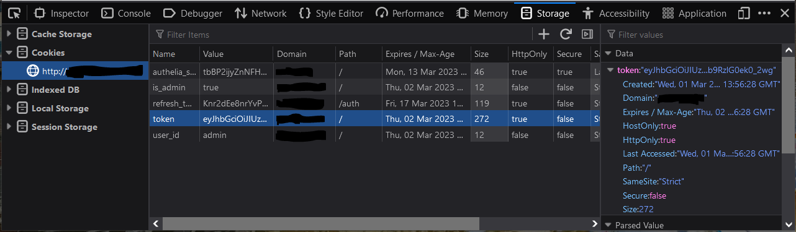

# Scripting

Programmatically accessing LLDAP can be done either through the LDAP protocol,
or via the GraphQL API.

## LDAP

Most _read-only_ queries about users and groups are supported. Anything not
supported would be considered a missing feature or a bug.

Most _modification_ queries are not supported, except for creating users and
changing the password (through the extended password operation). Those could be
added in the future, on a case-by-case basis.

Most _meta_-queries about the LDAP server itself are not supported and are out
of scope. That includes anything that touches the schema, for instance. LLDAP
still supports basic RootDSE queries.

Anonymous bind is not supported.

## GraphQL

The best way to interact with LLDAP programmatically is via the GraphQL
interface. You can use any language that has a GraphQL library (most of them
do), and use the [GraphQL Schema](../schema.graphql) to guide your queries.

### Getting a token

You'll need a JWT (authentication token) to issue GraphQL queries. Your view of
the system will be limited by the rights of your user. In particular, regular
users can only see themselves and the groups they belong to (but not other
members of these groups, for instance).

#### Manually

Log in to the web front-end of LLDAP. Then open the developer tools (F12), find
the "Storage > Cookies", and you'll find the "token" cookie with your JWT.



#### Automatically

The easiest way is to send a json POST request to `/auth/simple/login` with
`{"username": "john", "password": "1234"}` in the body.
Then you'll receive a JSON response with:

```
{
  "token": "eYbat...",
  "refreshToken": "3bCka...",
}
```

### Using the token

You can use the token directly, either as a cookie, or as a bearer auth token
(add an "Authorization" header with contents `"Bearer <token>"`).

The JWT is valid for 1 day (unless you log out explicitly).
You can use the refresh token to query `/auth/refresh` and get another JWT. The
refresh token is valid for 30 days.

### Testing your GraphQL queries

You can go to `/api/graphql/playground` to test your queries and explore the
data in the playground. You'll need to provide the JWT in the headers:

```
{ "Authorization": "Bearer abcdef123..." }
```

Then you can enter your query, for instance:

```graphql
{
  user(userId:"admin") {
    displayName
  }
  groups {
    id
    displayName
    users {
      id
      email
    }
  }
}
```

The schema is on the right, along with some basic docs.
