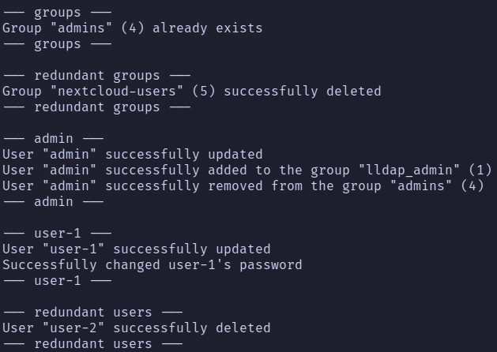

# Bootstrapping lldap using [bootstrap.sh](/scripts/bootstrap.sh) script

bootstrap.sh allows managing your lldap in a git-ops, declarative way using JSON config files.

The script can:

* create, update users
  * set/update all lldap built-in user attributes
  * add/remove users to/from corresponding groups
  * set/update user avatar from file, link or from gravatar by user email
  * set/update user password
* create groups
* delete redundant users and groups (when `DO_CLEANUP` env var is true)
* maintain the desired state described in JSON config files
* create user/group user-defined attributes



## Required packages

> The script will automatically install the required packages for alpine and debian-based distributions
> when run by root, or you can install them by yourself.

- curl
- [jq](https://github.com/jqlang/jq)
- [jo](https://github.com/jpmens/jo)

## Environment variables

- `LLDAP_URL` or `LLDAP_URL_FILE` (default value: `http://localhost:17170`) - URL to your lldap instance or path to file that contains URL
- `LLDAP_ADMIN_USERNAME` or `LLDAP_ADMIN_USERNAME_FILE` (default value: `admin`) - admin username or path to file that contains username
- `LLDAP_ADMIN_PASSWORD` or `LLDAP_ADMIN_PASSWORD_FILE` (default value: `password`) - admin password or path to file that contains password
- `USER_CONFIGS_DIR` (default value: `/bootstrap/user-configs`) - directory where the user JSON configs could be found
- `GROUP_CONFIGS_DIR` (default value: `/bootstrap/group-configs`) - directory where the group JSON configs could be found
- `USER_SCHEMAS_DIR` (default value: `/bootstrap/user-schemas`) - directory where the user schema JSON configs could be found
- `GROUP_SCHEMAS_DIR` (default value: `/bootstrap/group-schemas`) - directory where the group schema JSON configs could be found
- `LLDAP_SET_PASSWORD_PATH` - path to the `lldap_set_password` utility (default value: `/app/lldap_set_password`)
- `DO_CLEANUP` (default value: `false`) - delete groups and users not specified in config files, also remove users from groups that they do not belong to

## Config files

There are two types of config files: [group](#group-config-file-example) and [user](#user-config-file-example) configs.
Each config file can be as one JSON file with nested JSON top-level values as several JSON files.

### Group config file example

Group configs are used to define groups that will be created by the script

Fields description:

* `name`: name of the group (**MANDATORY**)

```json
{
  "name": "group-1"
}
{
  "name": "group-2"
}
```

### User config file example

User config defines all the lldap user structures,
if the non-mandatory field is omitted, the script will clean this field in lldap as well.

Fields description:

* `id`: it's just username (**MANDATORY**)
* `email`: self-explanatory (**MANDATORY**)
* `password`: would be used to set the password using `lldap_set_password` utility
* `displayName`: self-explanatory
* `firstName`: self-explanatory
* `lastName`: self-explanatory
* `avatar_file`: must be a valid path to jpeg file (ignored if `avatar_url` specified)
* `avatar_url`: must be a valid URL to jpeg file (ignored if `gravatar_avatar` specified)
* `gravatar_avatar` (`false` by default): the script will try to get an avatar from [gravatar](https://gravatar.com/) by previously specified `email` (has the highest priority)
* `weserv_avatar` (`false` by default): avatar file from `avatar_url` or `gravatar_avatar` would be converted to jpeg using [wsrv.nl](https://wsrv.nl) (useful when your avatar is png)
* `groups`: an array of groups the user would be a member of (all the groups must be specified in group config files)

```json
{
  "id": "username",
  "email": "username@example.com",
  "password": "changeme",
  "displayName": "Display Name",
  "firstName": "First",
  "lastName": "Last",
  "avatar_file": "/path/to/avatar.jpg",
  "avatar_url": "https://i.imgur.com/nbCxk3z.jpg",
  "gravatar_avatar": "false",
  "weserv_avatar": "false",
  "groups": [
    "group-1",
    "group-2"
  ]
}

```

### User and group schema config file example

User and group schema have the same structure.

Fields description:

* `name`: name of field, case insensitve - you should use lowercase
* `attributeType`: `STRING` / `INTEGER` / `JPEG` / `DATE_TIME`
* `isList`: single on multiple value field
* `isEditable`: self-explanatory
* `isVisible`: self-explanatory

```json
[
  {
    "name": "uid",
    "attributeType": "INTEGER",
    "isEditable": false,
    "isList": false,
    "isVisible": true
  },
  {
    "name": "mailbox",
    "attributeType": "STRING",
    "isEditable": false,
    "isList": false,
    "isVisible": true
  },
  {
    "name": "mail_alias",
    "attributeType": "STRING",
    "isEditable": false,
    "isList": true,
    "isVisible": true
  }
]
```

## Usage example

### Manually

The script can be run manually in the terminal for initial bootstrapping of your lldap instance.
You should make sure that the [required packages](#required-packages) are installed
and the [environment variables](#environment-variables) are configured properly.

```bash
export LLDAP_URL=http://localhost:8080
export LLDAP_ADMIN_USERNAME=admin
export LLDAP_ADMIN_PASSWORD=changeme
export USER_CONFIGS_DIR="$(realpath ./configs/user)"
export GROUP_CONFIGS_DIR="$(realpath ./configs/group)"
export USER_SCHEMAS_DIR="$(realpath ./configs/user-schema)"
export GROUP_SCHEMAS_DIR="$(realpath ./configs/group-schema)"
export LLDAP_SET_PASSWORD_PATH="$(realpath ./lldap_set_password)"
export DO_CLEANUP=false
./bootstrap.sh
```

### Manually from running docker container or service

After setting a docker container you can bootstrap users using:

```
docker exec -e LLDAP_ADMIN_PASSWORD_FILE=password -v ./bootstrap:/bootstrap -it $(docker ps --filter name=lldap -q) /app/bootstrap.sh
```

### Docker compose

Let's suppose you have the next file structure:

```text
./
├─ docker-compose.yaml
└─ bootstrap
   ├─ bootstrap.sh
   └─ user-configs
   │  ├─ user-1.json
   │  ├─ ...
   │  └─ user-n.json
   └─ group-configs
   |  ├─ group-1.json
   |  ├─ ...
   |  └─ group-n.json
   └─ user-schames
   |  ├─ user-attrs-1.json
   |  ├─ ...
   |  └─ user-attrs-n.json
   └─ group-schames
      ├─ group-attrs-1.json
      ├─ ...
      └─ group-attrs-n.json
```

You should mount `bootstrap` dir to lldap container and set the corresponding `env` variables:

```yaml
version: "3"

services:
  lldap:
    image: lldap/lldap:v0.5.0
    volumes:
      - ./bootstrap:/bootstrap
    ports:
      - "3890:3890" # For LDAP
      - "17170:17170" # For the web front-end
    environment:
      # envs required for lldap
      - LLDAP_LDAP_USER_EMAIL=admin@example.com
      - LLDAP_LDAP_USER_PASS=changeme
      - LLDAP_LDAP_BASE_DN=dc=example,dc=com
      
      # envs required for bootstrap.sh
      - LLDAP_URL=http://localhost:17170
      - LLDAP_ADMIN_USERNAME=admin
      - LLDAP_ADMIN_PASSWORD=changeme # same as LLDAP_LDAP_USER_PASS
      - USER_CONFIGS_DIR=/bootstrap/user-configs
      - GROUP_CONFIGS_DIR=/bootstrap/group-configs
      - USER_SCHEMAS_DIR=/bootstrap/user-schemas
      - GROUP_SCHEMAS_DIR=/bootstrap/group-schemas
      - DO_CLEANUP=false
```

Then, to bootstrap your lldap just run `docker compose exec lldap /bootstrap/bootstrap.sh`.
If config files were changed, re-run the `bootstrap.sh` with the same command.

### Kubernetes job

```yaml
apiVersion: batch/v1
kind: Job
metadata:
  name: lldap-bootstrap
  # Next annotations are required if the job managed by Argo CD,
  # so Argo CD can relaunch the job on every app sync action
  annotations: 
    argocd.argoproj.io/hook: PostSync
    argocd.argoproj.io/hook-delete-policy: BeforeHookCreation
spec:
  template:
    spec:
      restartPolicy: OnFailure
      containers:
        - name: lldap-bootstrap
          image: lldap/lldap:v0.5.0

          command:
            - /bootstrap/bootstrap.sh

          env:
            - name: LLDAP_URL
              value: "http://lldap:8080"

            - name: LLDAP_ADMIN_USERNAME
              valueFrom: { secretKeyRef: { name: lldap-admin-user, key: username } }

            - name: LLDAP_ADMIN_PASSWORD
              valueFrom: { secretKeyRef: { name: lldap-admin-user, key: password } }

            - name: DO_CLEANUP
              value: "true"

          volumeMounts:
            - name: bootstrap
              mountPath: /bootstrap/bootstrap.sh
              readOnly: true
              subPath: bootstrap.sh

            - name: user-configs
              mountPath: /bootstrap/user-configs
              readOnly: true

            - name: group-configs
              mountPath: /bootstrap/group-configs
              readOnly: true

      volumes:
        - name: bootstrap
          configMap:
            name: bootstrap
            defaultMode: 0555
            items:
              - key: bootstrap.sh
                path: bootstrap.sh

        - name: user-configs
          projected:
            sources:
              - secret:
                  name: lldap-admin-user
                  items:
                    - key: user-config.json
                      path: admin-config.json
              - secret:
                  name: lldap-password-manager-user
                  items:
                    - key: user-config.json
                      path: password-manager-config.json
              - secret:
                  name: lldap-bootstrap-configs
                  items:
                    - key: user-configs.json
                      path: user-configs.json

        - name: group-configs
          projected:
            sources:
              - secret:
                  name: lldap-bootstrap-configs
                  items:
                    - key: group-configs.json
                      path: group-configs.json
```
