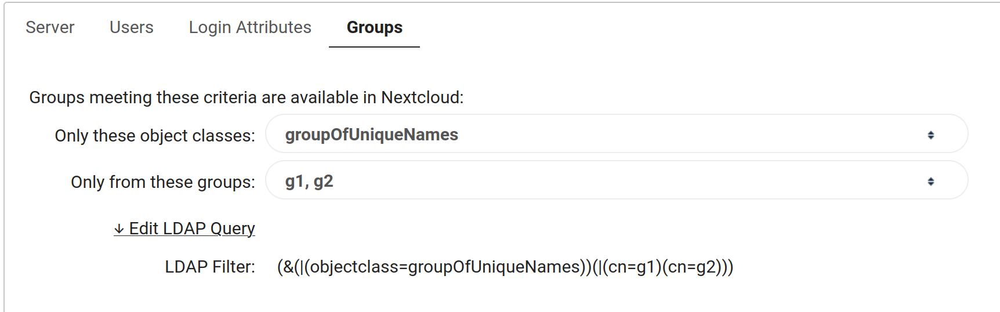
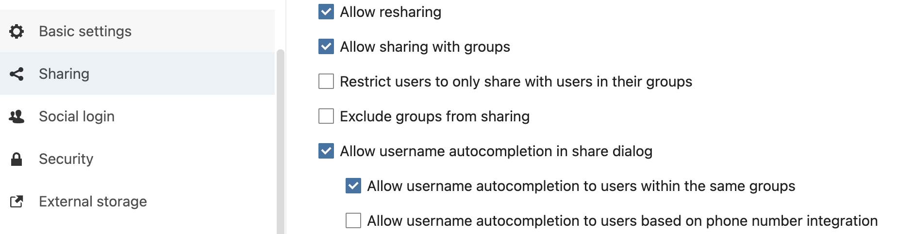

# Nextcloud LLDAP example config

## lldap users & groups

This example is using following users & groups in lldap :

* A technical user (ex: `ro_admin`), member of `lldap_strict_readonly` or `lldap_password_manager`
* A catch-all group called `nextcloud_users`.
* Members of `nextcloud_users` group will be authorized to log in Nextcloud.
* Some "application" groups, let's say `friends` and `family`: users in Nextcloud will be able to share files and view people in dynamic lists only to members of their own group(s).
* Users in `family` and `friends` should also be users in `nextcloud_users` group!  

If you plan on following this tutorial line-by-line, you will now have the following:
* 6 groups:
    1. `nextcloud_users`
    2. `family`
    3. `friends`
    4. `lldap_strict_readonly`
    5. `lldap_password_manager`
    6. `ldap_admin`
* 1 admin user in any of the following groups:
    1. `lldap_password_manager`
    2. `lldap_strict_readonly`
* (Atleast) 1 user in the `nextcloud_users` group 
* (Optional) Any number of users in the `friends` or `family` group.

## Nextcloud config : the cli way

TL;DR let's script it. The "user_ldap" application is shipped with default Nextcloud installation (at least using Docker official stable images), you just have to install & enable it :

```sh
occ app:install user_ldap
occ app:enable user_ldap
occ ldap:create-empty-config

# EDIT: domain
occ ldap:set-config s01 ldapHost "ldap://lldap.example.net."
occ ldap:set-config s01 ldapPort 3890
# EDIT: admin user
occ ldap:set-config s01 ldapAgentName "uid=ro_admin,ou=people,dc=example,dc=com"
# EDIT: password
occ ldap:set-config s01 ldapAgentPassword "password"
# EDIT: Base DN
occ ldap:set-config s01 ldapBase "dc=example,dc=com"
occ ldap:set-config s01 ldapBaseUsers "dc=example,dc=com"
occ ldap:set-config s01 ldapBaseGroups "dc=example,dc=com"
occ ldap:set-config s01 ldapConfigurationActive 1
occ ldap:set-config s01 ldapLoginFilter "(&(objectclass=person)(uid=%uid))"
# EDIT: nextcloud_users group, contains the users who can login to Nextcloud
occ ldap:set-config s01 ldapUserFilter "(&(objectclass=person)(memberOf=cn=nextcloud_users,ou=groups,dc=example,dc=com))"
occ ldap:set-config s01 ldapUserFilterMode 0
occ ldap:set-config s01 ldapUserFilterObjectclass person
occ ldap:set-config s01 turnOnPasswordChange 0
occ ldap:set-config s01 ldapCacheTTL 600
occ ldap:set-config s01 ldapExperiencedAdmin 0
occ ldap:set-config s01 ldapGidNumber gidNumber
# EDIT: list of application groups
occ ldap:set-config s01 ldapGroupFilter "(&(objectclass=groupOfUniqueNames)(|(cn=friends)(cn=family)))"
# EDIT: list of application groups
occ ldap:set-config s01 ldapGroupFilterGroups "friends;family"
occ ldap:set-config s01 ldapGroupFilterMode 0
occ ldap:set-config s01 ldapGroupDisplayName cn
occ ldap:set-config s01 ldapGroupFilterObjectclass groupOfUniqueNames
occ ldap:set-config s01 ldapGroupMemberAssocAttr uniqueMember
occ ldap:set-config s01 ldapLoginFilterEmail 0
occ ldap:set-config s01 ldapLoginFilterUsername 1
occ ldap:set-config s01 ldapMatchingRuleInChainState unknown
occ ldap:set-config s01 ldapNestedGroups 0
occ ldap:set-config s01 ldapPagingSize 500
occ ldap:set-config s01 ldapTLS 0
occ ldap:set-config s01 ldapUserAvatarRule default
occ ldap:set-config s01 ldapUserDisplayName displayname
occ ldap:set-config s01 ldapUserFilterMode 1
occ ldap:set-config s01 ldapUuidGroupAttribute auto
occ ldap:set-config s01 ldapUuidUserAttribute auto
```
With a bit of of luck, you should be able to log in your nextcloud instance with LLDAP accounts in the `nextcloud_users` group.

## Nextcloud config : the GUI way

1. enable LDAP application (installed but not enabled by default)
2. setup your ldap server in Settings > Administration > LDAP / AD integration
3. setup Group limitations

### LDAP server config

Fill the LLDAP domain and port, DN + password of your technical account and base DN (as usual : change `example.com` by your own domain) :


### Users tab

Select `person` as object class and then choose `Edit LDAP Query` : the `only from these groups` option is not functional.
We want only users from the `nextcloud_users` group to be allowed to log in Nextcloud :
```
(&(objectclass=person)(memberOf=cn=nextcloud_users,ou=groups,dc=example,dc=com))
```


You can check with `Verify settings and count users` that your filter is working properly (here your accounts `admin` and `ro_admin` will not be counted as users).

### Login attributes
Select `Edit LDAP Query` and enter :
```
(&(objectclass=person)(uid=%uid))
```


Enter a valid username in lldap and check if your filter is working.

### Groups

You can use the menus for this part : select `groupOfUniqueNames` in the first menu and check every group you want members to be allowed to view their group member / share files with.



## Sharing restrictions

Go to Settings > Administration > Sharing and check following boxes :

*  "Allow username autocompletion to users within the same groups"


