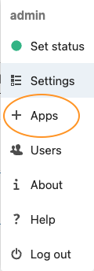
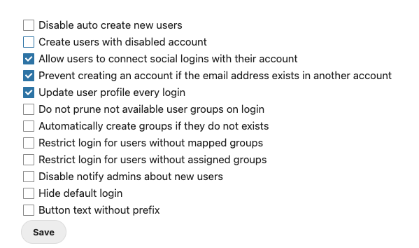
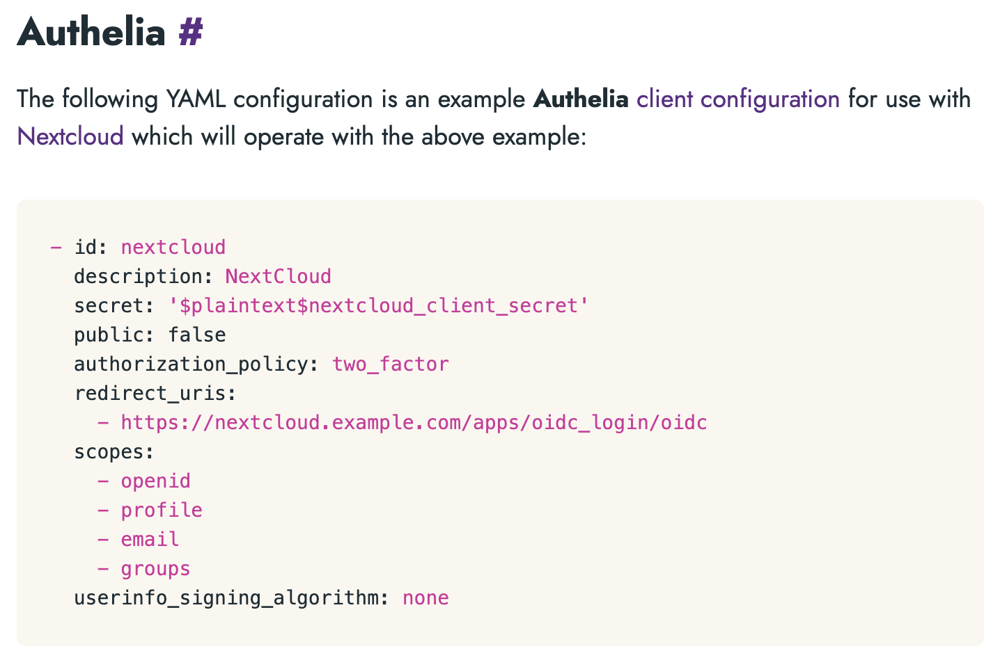

## Assumptions

If you're here, there are some assumptions being made about access and capabilities you have on your system:
1. You have Authelia up and running, understand its functionality, and have read through the documentation. 
2. You have [LLDAP](https://github.com/nitnelave/lldap) up and running. 
3. You have Nextcloud and LLDAP communicating and without any config errors. See the [example config for Nextcloud](nextcloud.md)

## Authelia

Set up Authelia according to its [documentation](https://www.authelia.com/overview/prologue/introduction/), including the [OpenID Connect](https://www.authelia.com/configuration/identity-providers/open-id-connect/) and [Nextcloud instructions](https://www.authelia.com/integration/openid-connect/nextcloud/).

## LLDAP

With LLDAP up and running, add a group and note the name you use. For this tutorial, we're using the group `nextcloud_users`. Create a new user and add it to the `nextcloud_users` group. 

#### Optional:
Once setup, add an admin or config user and add to the `lldap_strict_readonly` or `lldap_password_manager` group. This will be the config account used for Nextcloud to read your groups and users from the server. 

## Nextcloud
**_When we get to the OpenID section, we will be using the same defaults as Authelia's documentation. As a reminder, they are:_** 

* **Application Root URL:** https://nextcloud.example.com
* **Authelia Root URL:** https://auth.example.com
* [**Client ID:**](https://www.authelia.com/configuration/identity-providers/open-id-connect/#id) nextcloud
* [**Client Secret:**](https://www.authelia.com/configuration/identity-providers/open-id-connect/#secret) nextcloud_client_secret

Login to your Nextcloud instance as an admin. By now, you should have correctly setup Nextcloud and LLDAP to be communicating and working as expected. [See assumptions, above](#assumptions)

Next, navigate to the `Apps` section. 

Search for the Nextcloud app [Social Login](https://apps.nextcloud.com/apps/sociallogin). Enable the app. 

Once enabled, navigate to Settings > Administration > Social Login.

You'll see many different options for various auth methods, including major 3rd party integrations. For the top section, check off these three options:
* Allow Users to Connect Social Logins with their Account
* Prevent creating an account if the email address exists in another account
* Update user profile every login

_You can test out the other options such as preventing users without a group, but I haven't tested all the options. These are just the ones I know that worked so far._

Scroll down and select **Custom OpenID Connect**. Fill out the following options:

_The first two can be any string you'd like to identify the connection with. The Title is the string that will show up on the button at the login screen and the Internal Name will be used in the Redirect uri. [See point 3 in the section below](#some-notes)._

| Field | Value |
|--|--|
| Internal Name | Authelia | 
|Title	| Authelia OpenID |
|Authorize URL | https://auth.example.com/api/oidc/authorization |
|Token URL	| https://auth.example.com/api/oidc/token |
|Display Name Claim (Optional) | display_name |
|User info URL (Optional) | | 			
|Logout URL (Optional) | |
|Client ID:	| nextcloud |
|Client Secret:	| nextcloud_client_secret |
|Scope: | openid profile email groups |
|Groups Claim (Optional) | 	| 			
|Button Style | None |
|Default Group	| nextcloud_users | 

#### Some Notes
* The *scope* should be the same as the scope that was setup in [Authelia's OpenID Integration](https://www.authelia.com/integration/openid-connect/nextcloud/#authelia). Here's an example from Authelia:

* *_Do not_* use commas in the Nextcloud Social Login app scope! This caused many issues for me.
* Be sure you update your Authelia `configuration.yml`. Specifically, the line: `redirect_uris`. The new URL should be 
`https://auth.example.com/index.php/apps/sociallogin/custom_oidc/Authelia`. 
    * The final field in the URL (Authelia) needs to be the same value you used in the Social Login "Internal Name" field. 
* If you've setup LLDAP correctly in nextcloud, the last dropdown for _Default Group_ should show you the `nextcloud_users` group you setup in LLDAP. 

Once you've filled out the fields correctly, scroll to the bottom and hit save and confirm that you don't recieve any errors from Nextcloud. 

#### Config.php
Lastly, we need to add the following line to your `config.php` file on your Nextcloud Server. 
* `'social_login_auto_redirect' => false,`

If this is set to *false* your login screen will show the standard User/Email and Password input fields with an additional button underneath that should say: `Login with Authelia OpenID` (the name is coming from the Title field in the Social Login options we setup earlier). 

If this is set to *true* then the user flow will _skip_ the login page and automatically bring you to the Authelia Consent Page at `https://auth.example.com/consent?consent_id=alphanuber-uuid-string`

### Conclusion
And that's it! Assuming all the settings that worked for me, work for you, you should be able to login using OpenID Connect via Authelia. If you find any errors, it's a good idea to keep a document of all your settings from Authelia/Nextcloud/LLDAP etc so that you can easily reference and ensure everything lines up.

If you have any issues, please create a [discussion](https://github.com/nitnelave/lldap/discussions) or join the [Discord](https://discord.gg/h5PEdRMNyP).
