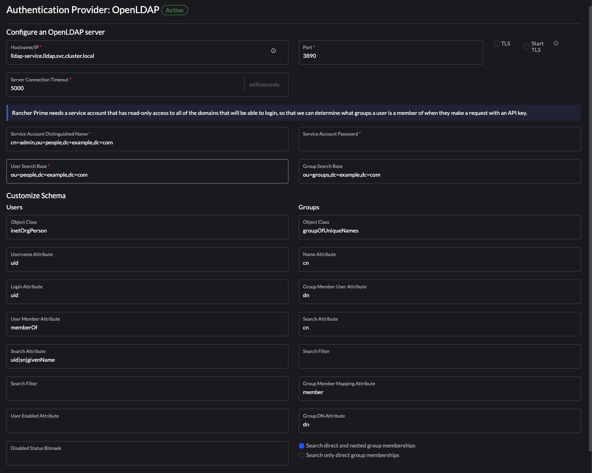

# Configuration for SUSE Rancher (any version)
###  Left (hamburger) menu > Users & Authentication > OpenLDAP (yes, we are using the OpenLDAP config page)
---

## LDAP configuration

#### Hostname/IP
```
ip-address, DNS name or when running in Kubernetes (see https://github.com/Evantage-WS/lldap-kubernetes), lldap-service.lldap.svc.cluster.local
```
#### Port
```
3890
```
#### Service Account Distinguished name
A better option is to use a readonly account for accessing the LLDAP server
```
cn=admin,ou=people,dc=example,dc=com
```
#### Service Account Password
```
xxx
```
#### User Search Base
```
ou=people,dc=example,dc=com
```

#### Group Search Base
```
ou=groups,dc=example,dc=com
```

#### Object Class (users)
```
inetOrgPerson
```

#### Object Class (groups)
```
groupOfUniqueNames
```

#### Username Attribute
```
uid
```

#### Name Attribute
```
cn
```

#### Login Attribute
```
uid
```

#### Group Member User Attribute
```
dn
```

#### User Member Attribute
```
memberOf
```

#### Search Attribute (groups)
```
cn
```

#### Search Attribute (users)
```
uid|sn|givenName
```

#### Group Member Mapping Attribute
```
member
```

#### Group DN Attribute
```
dn
```

##### Choose "Search direct and nested group memberships"

##### Fill in the username and password of an admin user at Test and Enable Authentication and hit save

## Rancher OpenLDAP config page

